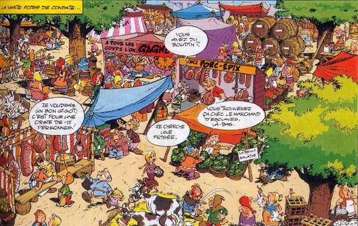
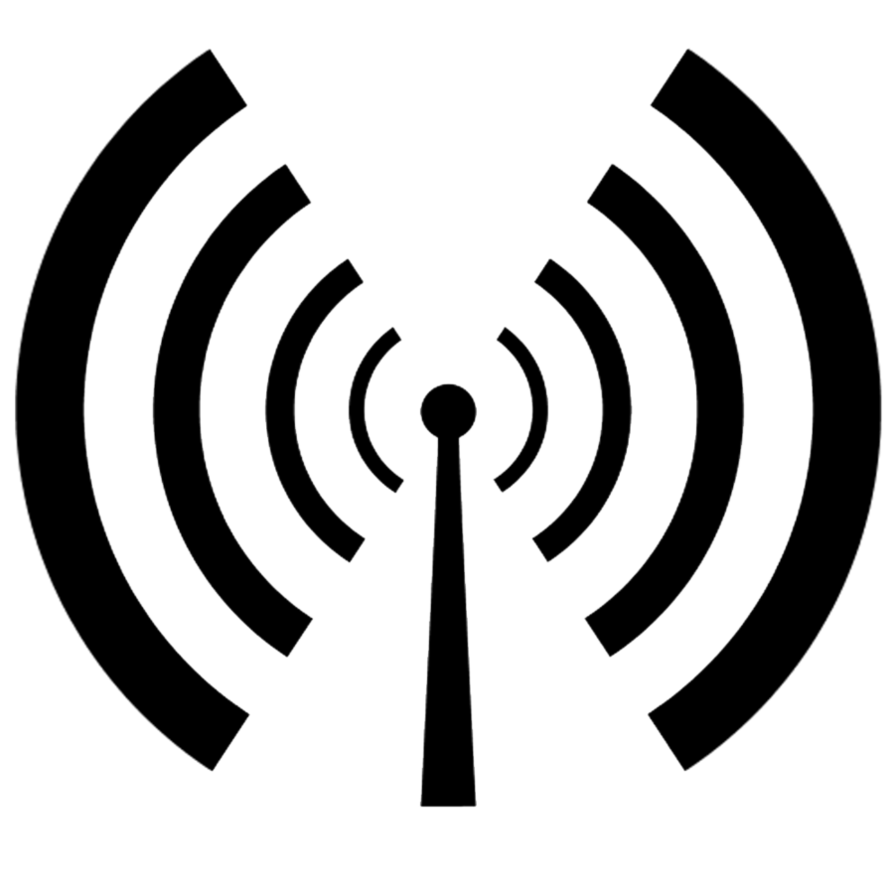
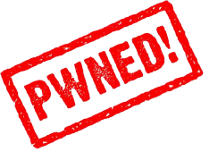
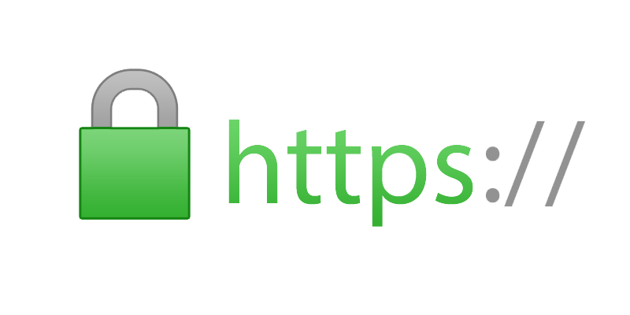
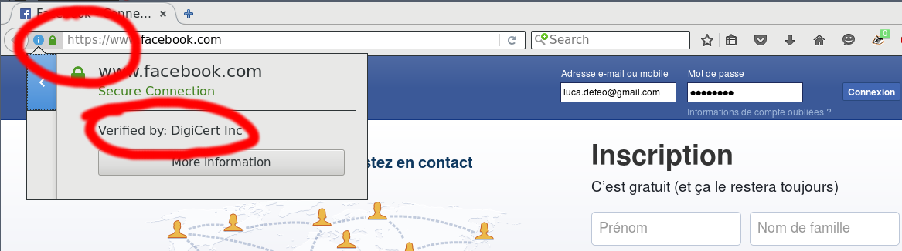
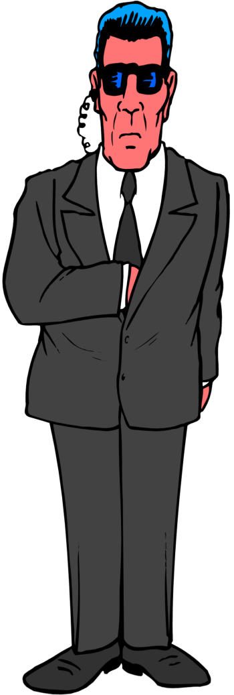

# Surfez en sécurité !

### Comprendre internet pour se protéger

<!-- -->
## Communiquer sur internet

...psst ...psst !

### C'EST PAR OÙ, FACEBOOK ?

<!-- -->
## Un espion dans mon Starbucks

## Même avec un mot de passe (WPA-PSK)

Dans les résaux wifi protégés par WEP ou WPA (ce que vous avez à la
maison), il suffit de capturer les paquets de la victime dès sa
connexion au réseau...

## Même sans connaître le mot de passe

 
<https://www.krackattacks.com/>

En 2017, des failles dans le protocole WPA ont permis de décrypter
tout le traffic WPA sans connaissance du mot de passe. (*Patchs de
sécurité* distribués à l'été 2017).

## La crypto met les espions à la porte

### HTTP + TLS = HTTPS

<!-- -->
## Prendre le chemin de moindre résistance

> Frankly, intelligence gets to break all sorts of rules, to cheat, to
> use other paths.

Michael Hayden, ex-directeur de la NSA

## DNS, les pages jaunes du web

`www.facebook.com`    →    `173.252.91.4`

- Associations entre *noms de domaine* et *addresses IP*
- Aucune sécurité: il n'y a pas de DNS **S**

## HTTP Strict Transport Security

|   |   |
|---|---|
| Chrome | >4.0 |
| Firefox | >2.0 |
| Internet Explorer | >11 |
| Android | >18 |
| iPhone | >8.4 |

|   |   |
|---|---|
| Facebook | ✓ |
| Google | ✓ |
| Twitter | ✓ |
| Instagram | ✓ |
| LinkedIn | ✓ |
| Société Générale | ✓ |
| BNP Paribas | ✓ |
| Crédit coopératif | × |
| Parcoursup | × |
| ... | |

<!-- -->
## Au delà des *script kiddies*

## NSA, PRISM, Freak, LogJam, ...

- Tout intercepter, tout enregistrer.
- Analyser les *meta-données*.
- Exploiter des failles logicielles pour affaiblir la sécurité de HTTPS.
- Utiliser des super-ordinateurs pour casser les protocoles affaiblis.

<!-- -->

**[ @luca_defeo](http://twitter.com/luca_defeo)**
